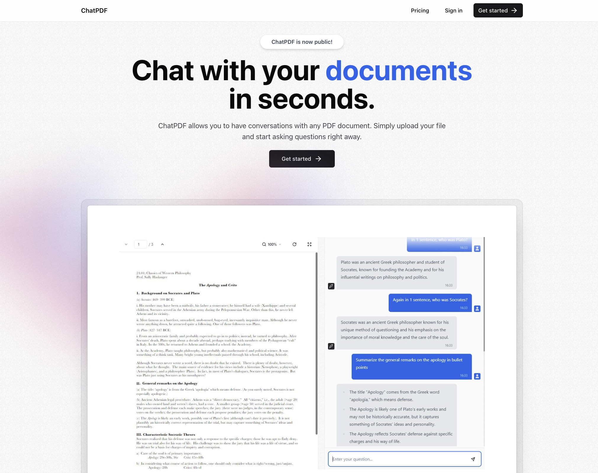

# AI Chat with PDF SaaS Platform with Next.js 13, React, Prisma, tRPC, Tailwind

Advanced SaaS AI Chat with PDF using Next.js 13, React, Prisma, tRPC, Tailwind.

It follows the tutorial made by [Josh tried coding](https://www.youtube.com/@joshtriedcoding). The YouTube video can be found [here](https://www.youtube.com/watch?v=ucX2zXAZ1I0). Harness the power of AI to extract information, answer questions, and gain deeper understanding from your PDFs effortlessly.

## Screenshot

## Features

- **Complete SaaS Built From Scratch**: Crafted meticulously for optimal performance and scalability.

- **Beautiful Landing Page & Pricing Page**: Engaging and user-friendly interfaces that capture user interest.

- **Authentication Using Kinde**: Secure and reliable user authentication process.

- **Free & Pro Plan Using Stripe**: Flexible pricing plans with seamless integration of Stripe for payment processing.

- **Infinite Message Loading for Performance**: Ensures smooth and uninterrupted chat experiences.

- **A Beautiful And Highly Functional PDF Viewer**: Designed for ease of use and enriched user interaction with PDFs.

- **Streaming API Responses in Real-Time**: Fast and efficient real-time communication with the OpenAI API.

- **Clean, Modern UI Using 'shadcn-ui'**: Aesthetically pleasing and intuitive user interface.

- **Optimistic UI Updates for a Great UX**: Responsive and interactive UI, enhancing user experience.

- **Intuitive Drag n’ Drop Uploads**: Simplified file uploads, enhancing usability.

- **Instant Loading States**: Quick and responsive application states for enhanced user interaction.

- **Modern Data Fetching Using tRPC & Zod**: Efficient and reliable data handling.

- **LangChain for Infinite AI Memory**: Advanced AI capabilities for comprehensive and contextual interactions.

- **Pinecone as our Vector Storage**: Utilizing Pinecone for efficient data indexing and retrieval.

- **Prisma as our ORM**: Robust object-relational mapping for effective database management.

- **100% written in TypeScript**: Ensures robustness and scalability of the application.

## Learn More

To learn more about Next.js, take a look at the following resources:

- [Next.js Documentation](https://nextjs.org/docs) - learn about Next.js features and API.
- [Learn Next.js](https://nextjs.org/learn) - an interactive Next.js tutorial.

You can check out [the Next.js GitHub repository](https://github.com/vercel/next.js/) - your feedback and contributions are welcome!

## Deploy on Vercel

The easiest way to deploy your Next.js app is to use the [Vercel Platform](https://vercel.com/new?utm_medium=default-template&filter=next.js&utm_source=create-next-app&utm_campaign=create-next-app-readme) from the creators of Next.js.

Check out our [Next.js deployment documentation](https://nextjs.org/docs/deployment) for more details.

## Acknowledgments

Big thanks to [Josh tried coding](https://www.youtube.com/@joshtriedcoding) for the great tutorial.